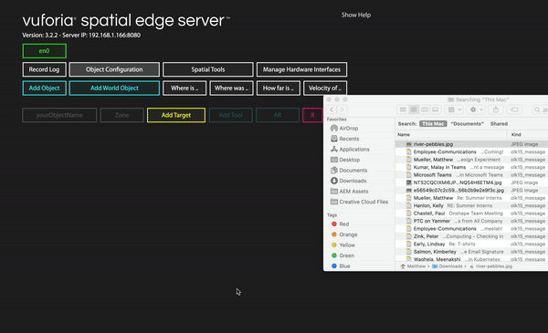

# Getting Started with Spatial Toolbox on Arduino #

This tutorial will take you through the basic steps for getting set up with the Arduino hardware interface with the Vuforia Spatial Toolbox.

</img>

### Step 1:
Start by downloading and installing the Vuforia Spatial Toolbox from one of the links below. You should end up with a folder on your computer called "vuforia-spatial-edge-server".
* [Install on a Mac](https://spatialtoolbox.vuforia.com/docs/use/connect-to-the-physical-world/install-on-mac)
* [Install on Windows](https://spatialtoolbox.vuforia.com/docs/use/connect-to-the-physical-world/install-on-windows)
* [Install on a Raspberry Pi](https://spatialtoolbox.vuforia.com/docs/vuforia-spatial-edge-server/raspberry-pi)

### Step 2:
Install the basic interfaces addon in the addons folder of your spatial edge server following [these instructions](https://github.com/ptcrealitylab/vuforia-spatial-basic-interfaces-addon). 

### Step 3:
You should now have a file structure that looks something like this "/Documents/vuforia-spatial-edge-server/addons/vuforia-spatial-basic-interfaces-addon/interfaces/arduinoUno". In that folder titled "arduinoUno", you should see a zip file titled "Vuforia-Spatial-Arduino-Library.zip" (the file is also available [here](Vuforia-Spatial-Arduino-Library.zip)). Now in the Adruino IDE, navigate to "Sketch > Inlude Library > Add .zip Library..." and select the "Vuforia-Spatial-Arduino-Library.zip" file.

### Step 4:
In Arduino, you should now have the example sketches form the added zip library. From "File > Examples > Vuforia-Spatial-Arduino-Library", open the "readWrite" sketch, and upload it to your Arduino device. Once is has been uploaded, disconnect your device from the USB and close the Arduino IDE (this ensures that the serial port is free).

### Step 5:
Launch your Spatial Edge Server by running "node server" from within the "/vuforia-spatial-edge-server" file path. You should now be able to see the web interface manager in your browser at the URL "http://localhost:8080/". From the web interface, under "Manage Hardware Interfaces", you should see an option titled "arduinoUno". Plug your Arduino back into the USB, then turn on the hardware interface. You should now see the "TX" pin on your Arduino blinking, indicating that it is sending information to the server. 

</img>

### Step 6:
Now go to the "Object Configuration" tab of the web interface. Click "Add Object" and type in "yourObjectName" (or whatever you changed the "yourObjectName" field to in your "readWrite" example sketch). After clicking "Add", you should now see an object appear with that name. Click on "Add Target", then drag a JPG file into the drop zone that appears. Once the image is uploaded, you should see and item called "arduino01" appear under the "yourObjectName" object, and you should now see both the RX and TX lights flashing on your arduino. If you click on "arduino01", you should see info on the nodes included in the object, with the generator value changing. **Note: the image you select will determine how good the tracking is - the busier the image, the better it will be**. 

</img>

### Step 7:
Download and open the "Vuforia Spatial Toolbox" app on your mobile device (currently only available for iOS), ensuring that your device is on the same wifi network as your compuer running the spatial edge server. As soon as you look at the image that you used as the "Target" for you object, you should see a blue square appear around it, indicating that tracking has started.

### Step 8:
You can add tools to the object by clicking on the pocket icon on the right side of the screen, and placing them in the work space. When you click the programming tab (the three circles), you will see the nodes that were added in the Arduino sketch (LED and generator in the example). You can draw lines between the nodes to connect them and start sending and visualizing data to and from your arduino. You can learn more about the Spatial Toolbox app interface [here](https://spatialtoolbox.vuforia.com/docs/use/using-the-app). 

</img>

